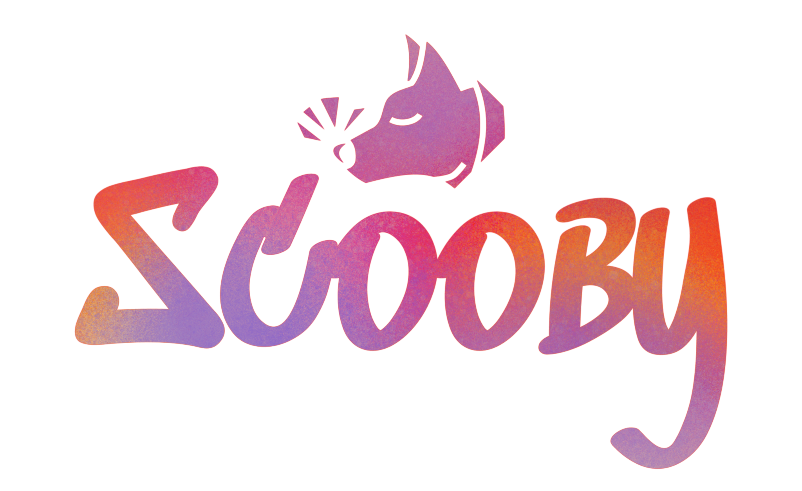

&nbsp;&nbsp;&nbsp;&nbsp;&nbsp;&nbsp;&nbsp;&nbsp;&nbsp;&nbsp;&nbsp;&nbsp;&nbsp;&nbsp;&nbsp;&nbsp;&nbsp;&nbsp;&nbsp;&nbsp;
&nbsp;&nbsp;&nbsp;&nbsp;&nbsp;&nbsp;&nbsp;&nbsp;&nbsp;&nbsp;&nbsp;&nbsp;&nbsp;&nbsp;&nbsp;&nbsp;&nbsp;&nbsp;&nbsp;&nbsp;
&nbsp;&nbsp;&nbsp;&nbsp;&nbsp;&nbsp;&nbsp;&nbsp;&nbsp;&nbsp;&nbsp;
[![Language][scala-shield]][scala-url]
[![MIT License][license-shield]][license-url]
[![Contributors][contributors-shield]][contributors-url]
[![Issues][issues-shield]][issues-url]

## Overview:

Scooby is a web scraping and crawling application. It enables users to extract data from web pages by crawling through
links and scraping specific content according to predefined rules.

## Features:

🕷 **Crawling**: The application navigates web pages, follows links, and retrieves content.

🔍 **Scraping**: Relevant data is extracted from HTML/XML pages using XPath, CSS selectors, or regular expressions.

🛠 **Customization**: Users can define custom scraping and crawling rules to suit their specific needs.

⚙️ **Parallel Processing**: Aspects of parallel programming are integrated for efficient execution.

📤 **Export**: Users can export extracted data in various formats according to their preferences.

## Get Started:

To use PPS-22-Scooby, have a look at the section **Get Started** at https://pps-22-scooby.github.io/

## Implementation:

Scooby is built using Scala with Actor libraries for concurrency management. The application utilizes Git for version
control, YouTrack for project management, and Github Actions for continuous integration.

## Team:

👨‍💻 Giovanni Antonioni - giovanni.antonioni2@studio.unibo.it

👨‍💻 Valerio Di Zio - valerio.dizio@studio.unibo.it

👨‍💻 Francesco Magnani - francesco.magnani14@studio.unibo.it

👨‍💻 Luca Rubboli - luca.rubboli2@studio.unibo.it

## Technologies:

🔄 Scrum

🛠 SBT

🔗 Git

🎯 YouTrack

🚀 Github Actions

## Other mentions

Thanks to [Game icons](https://game-icons.net/) and [Delapouite](https://delapouite.com/) for the dog icon in the logo

<!--
***
    GITHUB SHIELDS VARIABLES
***
-->

[scala-shield]: https://img.shields.io/badge/scala-%23DC322F.svg?style=flat&logo=scala&logoColor=white

[scala-url]: https://www.scala-lang.org/

[stars-shield]: https://img.shields.io/github/stars/roostico/scooby.svg?style=flat

[stars-url]: https://github.com/roostico/scooby/stargazers

[issues-shield]: https://img.shields.io/github/issues/roostico/scooby.svg?style=flat

[issues-url]: https://github.com/roostico/scooby/issues

[license-shield]: https://img.shields.io/github/license/roostico/scooby.svg?style=flat

[license-url]: https://github.com/roostico/scooby/blob/master/LICENSE.txt

[contributors-shield]: https://img.shields.io/github/contributors/roostico/scooby.svg?style=flat

[contributors-url]: https://github.com/roostico/scooby/graphs/contributors
